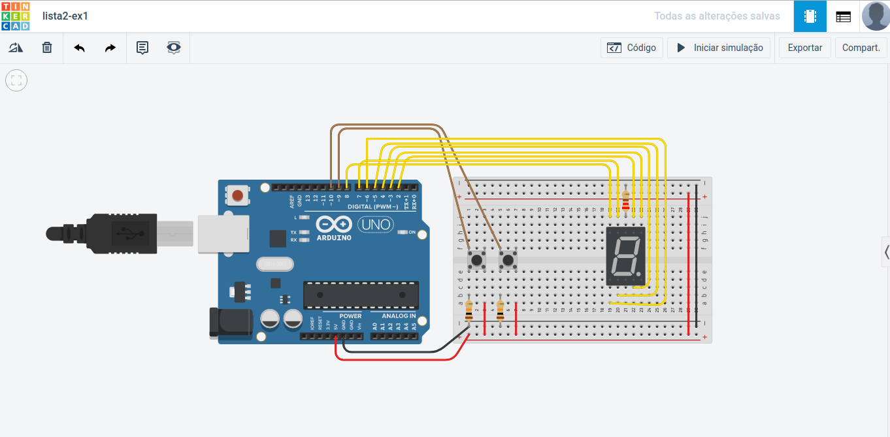
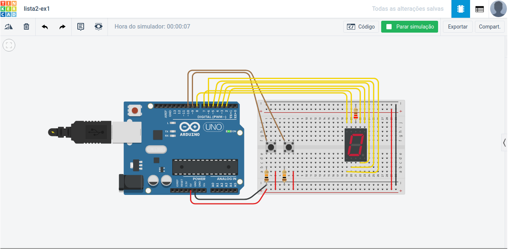
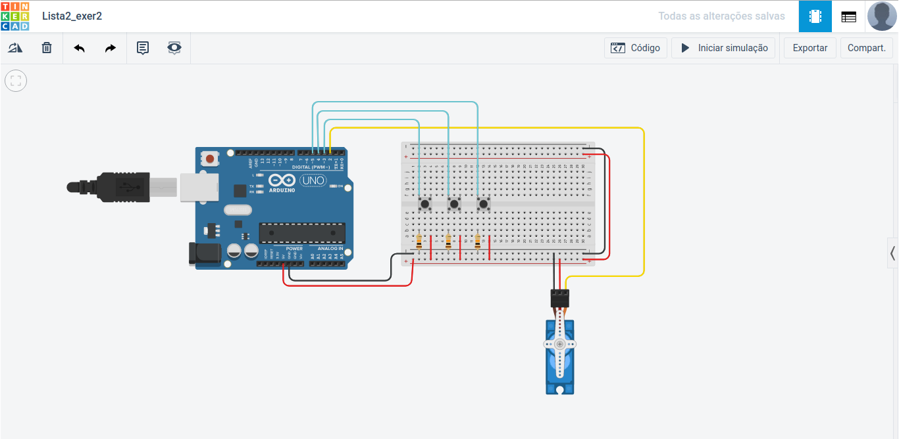
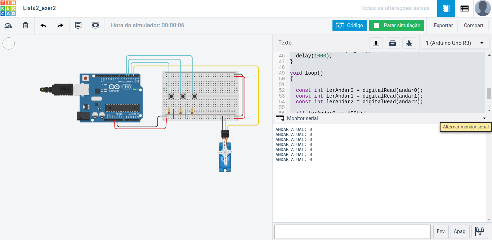
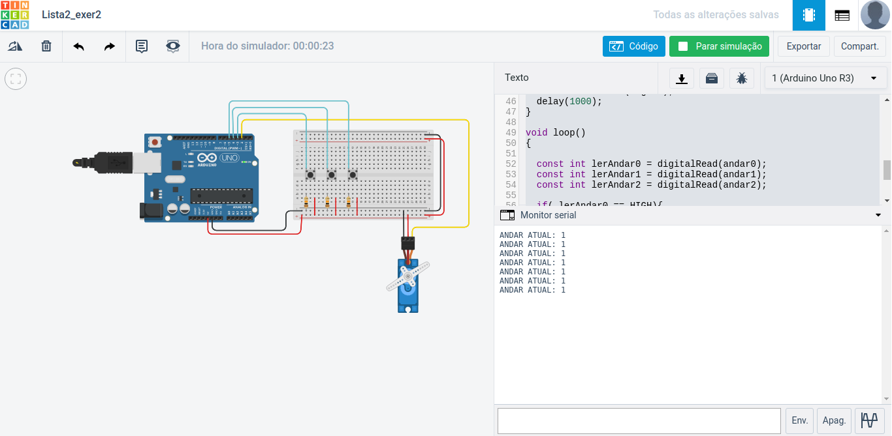
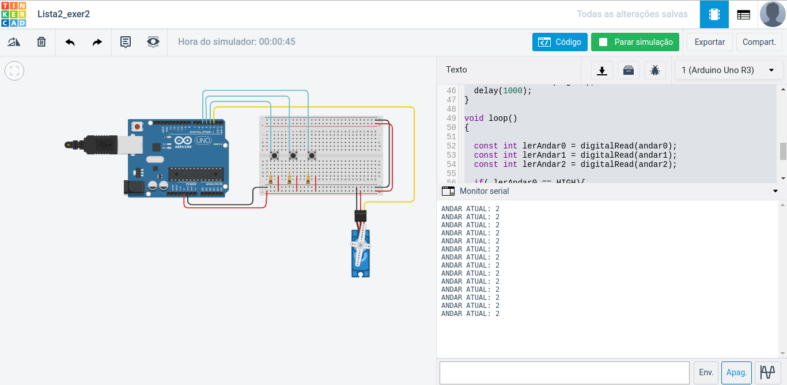

# SISTEMAS EMBARCADOS: LISTA PARA SIMULAÇÕES EM ARDUÍNO

## [_*LISTA DE EXERCÍCIOS E RESPOSTAS*_](https://github.com/felipekian/SISTEMAS-EMBARCADOS-LISTA/tree/master/Lista)

## [_*PLATAFORMA UTILIZADA*_](https://www.tinkercad.com/)


### QUESTÃO 1:

Implemente os seguintes esquema abaixo que deverá controlará um display de 7 segmentos que irá conectado diretamente ao Arduíno e fará um contador hexadecimal configurável através de duas teclas onde você pode usá-lo de forma crescente (0-9) e decrescente (9-0). Descreva o
resultado usando o simulador.

#### CÓDIGO FONTE EM LINGUAGEM C

```
const int botao1 = 9;
const int botao2 = 10;
int valor = 0;

byte hexadecimal[16][7] = {
  { 1,1,1,1,1,1,0 }, // = Digito 0
  { 0,1,1,0,0,0,0 }, // = Digito 1
  { 1,1,0,1,1,0,1 }, // = Digito 2
  { 1,1,1,1,0,0,1 }, // = Digito 3
  { 0,1,1,0,0,1,1 }, // = Digito 4
  { 1,0,1,1,0,1,1 }, // = Digito 5
  { 1,0,1,1,1,1,1 }, // = Digito 6
  { 1,1,1,0,0,0,0 }, // = Digito 7
  { 1,1,1,1,1,1,1 }, // = Digito 8
  { 1,1,1,0,0,1,1 }, // = Digito 9
  { 1,1,1,0,1,1,1 }, // = Digito A
  { 0,0,1,1,1,1,1 }, // = Digito B
  { 1,0,0,1,1,1,0 }, // = Digito C
  { 0,1,1,1,1,0,1 }, // = Digito D
  { 1,0,0,1,1,1,1 }, // = Digito E
  { 1,0,0,0,1,1,1 } // = Digito F
};

void setup()
{
  pinMode(botao1, INPUT);
  pinMode(botao2, INPUT);
  pinMode(2, OUTPUT);
  pinMode(3, OUTPUT);
  pinMode(4, OUTPUT);
  pinMode(5, OUTPUT);
  pinMode(6, OUTPUT);
  pinMode(7, OUTPUT);
  pinMode(8, OUTPUT);
  Serial.begin(9600);
}

void imprimirLCD(int valor){
  for(int i=0; i<7; i++){
    const int v = hexadecimal[valor][i];
    if(v == 1){
      digitalWrite( (i+2), HIGH);
    } else {
      digitalWrite((i+2), LOW);
    }
  }
  delay(100);
}

int valorVerificar(int valor)
{
  if (valor > 9) valor = 9;
  if (valor < 0 ) valor = 0;
  return valor;
}

void loop()
{
  int button1State = digitalRead(botao1);
  int button2State = digitalRead(botao2);
  
  if (button1State == HIGH)
  {
    Serial.println("\nSubtrair");
    valor = valorVerificar(valor-1);
    imprimirLCD(valor);
  }
  else if(button2State == HIGH) 
  {
    Serial.println("\nAdicionar");
    valor = valorVerificar(valor+1);
    imprimirLCD(valor);
  }else
  {
    imprimirLCD(valor);
  }
  delay(500);
}
```

### MODELAGEM NO TINKERCAD




### TESTES DO SISTEMA




---

## QUESTÃO 2:

Crie um programa para controlar um elevador que atenda 3 andares (1 butão para cada andar), onde cada andar e correspondente as seguintes posições em graus de um servo motor: andar 0 = 0 graus; andar 1 = 127 graus; e andar 3 = 255 graus. Apresente um esquema da ligação dos componentes necessários. Descreva o resultado usando o simulador.


### PROTÓTIPO ARDUÍNO




### CÓDIGO FONTE EM LINGUAGEM C

```
#include <Servo.h> // usa a biblioteca para servomotor

Servo servoMotor;
const int servoMotorPort = 2;
const int andar0 = 3;
const int andar1 = 4;
const int andar2 = 5;
int andarAtual = 0;

void setup(){
  pinMode(andar0, INPUT);
  pinMode(andar0, INPUT);
  pinMode(andar0, INPUT);
  servoMotor.attach(servoMotorPort);
  Serial.begin(9600);
}

void moveAndar(int andar){
  Serial.print("ANDAR ATUAL: ");
  Serial.println(andar);
  double angulo;
  
  if(andar == 0)
  {
    angulo = 0;
  }
  else if(andar == 1)
  {
    angulo = 127;
  }
  else
  {
    angulo = 255;
  }
  
  servoMotor.write(angulo);
  delay(1000);
}

void loop()
{
  const int lerAndar0 = digitalRead(andar0);
  const int lerAndar1 = digitalRead(andar1);
  const int lerAndar2 = digitalRead(andar2);
  
  if( lerAndar0 == HIGH)
  {
    andarAtual = 0;
  }
  else if( lerAndar1 == HIGH)
  {
    andarAtual = 1;
  }
  else if( lerAndar2 == HIGH)
  {
    andarAtual = 2;
  }
  
  moveAndar(andarAtual);
}
```

### TESTES SIMULAÇÃO

#### ANDAR 0


#### ANDAR 1


#### ANDAR 2


---

# OBRIGADO PELA ATENÇÃO!

